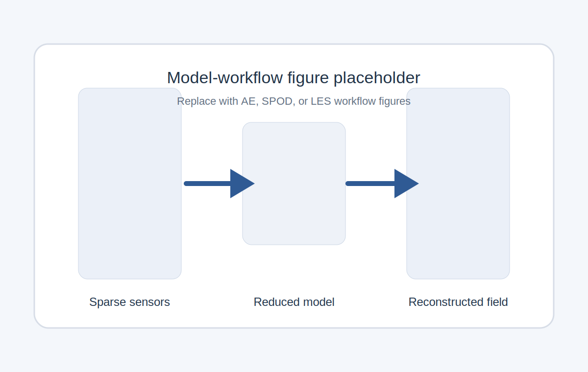
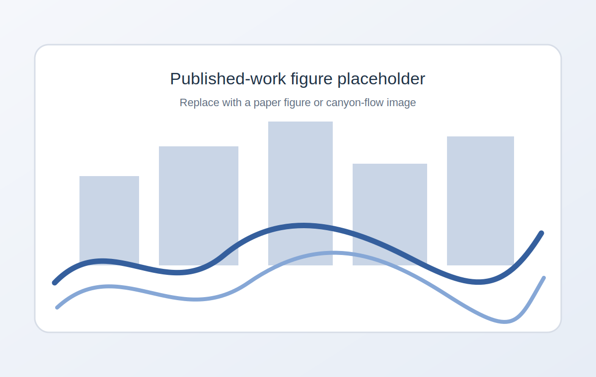

<!DOCTYPE html>
<html lang="en">
<head>
  <meta charset="UTF-8" />
  <meta name="viewport" content="width=device-width, initial-scale=1.0" />
  <title>Haoran Du</title>
  <meta name="description" content="Academic website of Haoran Du, PhD student in Mechanical Engineering at Western University." />
  <link rel="stylesheet" href="style.css" />
</head>
<body>
  <header class="site-header">
    

      <a class="brand" href="#top">Haoran Du</a>
      <nav class="site-nav" aria-label="Primary">
        <a href="#about">About</a>
        <a href="#research">Research</a>
        <a href="#outputs">Outputs</a>
        <a href="#contact">Contact</a>
      </nav>
    

  </header>

  <main id="top">
    <section class="hero">
      

        

          
Academic Homepage

          <h1>Haoran Du</h1>
          

            PhD student in Mechanical Engineering at Western University, working on urban flow,
            atmospheric boundary layer dynamics, large-eddy simulation, wind-tunnel experiments,
            and sensor-informed reduced-order modelling.
          

          

            I build links between experiments, computation, and data-driven methods to study turbulence,
            pollutant dispersion, and thermal transport in urban environments.
          

          

            <a class="button button-primary" href="#outputs">Selected outputs</a>
            <a class="button" href="#contact">Contact</a>
          

          <ul class="quick-facts">
            <li><strong>Affiliation</strong>Western University</li>
            <li><strong>Location</strong>London, Ontario, Canada</li>
            <li><strong>ORCID</strong>0000-0002-0848-7875</li>
          </ul>
        

        <aside class="profile-card">
          
          

            
Mechanical Engineering · Western University

            

              Replace <code>assets/images/profile-placeholder.svg</code> with your own photo, keeping the same path or changing it here.
            

          

        </aside>
      

    </section>

    <section id="about" class="section">
      

        

          
01

          <h2>About</h2>
        

        

          

            I am a doctoral student in Mechanical Engineering at Western University. My work combines fluid mechanics,
            wind engineering, large-eddy simulation, wind-tunnel experimentation, and data-driven modelling to study
            atmospheric boundary layer flow and urban canopy flow.
          

          

            Alongside my engineering training, I am also completing an online Master of Data Science in Machine Learning
            at the University of Pittsburgh. My background spans computational fluid dynamics, particle image velocimetry,
            hot-wire anemometry, and reduced-order and neural-network-based methods.
          

          

            <article class="card">
              <h3>Education</h3>
              <ul class="clean-list">
                <li><strong>Western University</strong> PhD in Mechanical Engineering, expected 2028</li>
                <li><strong>University of Pittsburgh</strong> Master of Data Science in Machine Learning, expected 2026</li>
                <li><strong>Western University</strong> Master of Engineering Science in Mechanical Engineering, 2021–2023</li>
                <li><strong>University of Cincinnati</strong> BSc in Mechanical Engineering, 2015–2020</li>
                <li><strong>Chongqing University</strong> BEng in Mechanical Engineering, 2015–2020</li>
              </ul>
            </article>

            <article class="card">
              <h3>Research appointments</h3>
              <ul class="clean-list">
                <li><strong>Graduate Research Assistant</strong> Western University, 2025–present</li>
                <li><strong>Voluntary Research Assistant</strong> Western University, 2024–2025</li>
                <li><strong>Graduate Research Assistant</strong> Western University, 2021–2023</li>
                <li><strong>Visiting Research Assistant</strong> Ecole Centrale de Nantes, 2022, 2023, 2026</li>
              </ul>
            </article>
          

        

      

    </section>

    <section id="research" class="section alt-section">
      

        

          
02

          <h2>Research</h2>
        

        

          

            <article class="card">
              <h3>Urban flow and atmospheric boundary layer interaction</h3>
              

                I study how upstream morphology, tall buildings, and canyon geometry modify mean flow,
                turbulence structure, and exchange between the urban canopy and the overlying atmospheric boundary layer.
              

            </article>

            <article class="card">
              <h3>Large-eddy simulation and wind-tunnel experiments</h3>
              

                My work integrates OpenFOAM-based LES with wind-tunnel measurements, including particle image velocimetry
                and hot-wire anemometry, to analyse urban canopy flow, pollutant dispersion, and convective heat transfer.
              

            </article>

            <article class="card">
              <h3>Reduced-order and data-driven modelling</h3>
              

                I develop POD or SPOD, linear stochastic estimation, autoencoders, convolutional neural networks,
                and other sensor-informed models for flow reconstruction and prediction.
              

            </article>
          

          <article class="card feature-block">
            

              
Ongoing projects

              <h3>Current directions</h3>
              <ul class="clean-list compact">
                <li>LES of idealised street canyons and tall-building interaction cases</li>
                <li>Urban turbulence, pollutant dispersion, and thermal effects in canopy flow</li>
                <li>Reconstruction of atmospheric boundary layer structures from sparse measurements</li>
                <li>Sensor-informed reduced-order models linking experiments and computation</li>
              </ul>
              

                You can replace this block later with short project pages, GitHub links, or a news section.
              

            

            

              
            

          </article>

          

            <figure class="gallery-card">
              
              <figcaption>Published-work image slot 1. Replace this with a figure from one of your papers.</figcaption>
            </figure>
            <figure class="gallery-card">
              
              <figcaption>Published-work image slot 2. Replace this with a workflow or reconstruction figure.</figcaption>
            </figure>
          

        

      

    </section>

    <section id="outputs" class="section">
      

        

          
03

          <h2>Selected Outputs</h2>
        

        

          <article class="card text-block">
            <h3>Selected presentations and teaching</h3>
            

              

                
Presentations

                <ul class="clean-list">
                  <li><strong>PHYSMOD 2026</strong> Reconstruction of large scales in atmospheric boundary layer flow with sparse measurements, Potsdam, Germany</li>
                  <li><strong>Graduate Student Symposium 2026</strong> Data-driven reconstruction of atmospheric boundary layer flow from sparse measurements, Western University</li>
                  <li><strong>CFDSC 2025</strong> Characteristics of street canyon flow using large-eddy simulation with a drag-porosity modelled atmospheric boundary layer, Montreal, Canada</li>
                  <li><strong>PHYSMOD 2024</strong> Scale interaction between the urban boundary layer and a street canyon in a morphological model, Lyon, France</li>
                </ul>
              

              

                
Teaching

                <ul class="clean-list">
                  <li><strong>Graduate Teaching Assistant</strong> Western University, 2022–present</li>
                  <li>Intro to Fluid Mechanics and Heat Transfer</li>
                  <li>Thermodynamics I</li>
                  <li>Heat Transfer II</li>
                  <li>Fluid Machinery</li>
                  <li>Product Design</li>
                  <li>System Modelling and Control</li>
                </ul>
              

            

          </article>

          <article class="card text-block">
            

              

                
Publications

                <h3>Selected journal papers</h3>
              

              
Edit <code>publications.json</code> to change titles, status, links, or figures.

            

            

          </article>
        

      

    </section>

    <section id="contact" class="section alt-section">
      

        

          
04

          <h2>Contact</h2>
        

        

          

            <article class="card">
              <h3>Contact information</h3>
              <ul class="clean-list">
                <li><strong>Email</strong> <a href="mailto:duhaoran@outlook.com">duhaoran@outlook.com</a></li>
                <li><strong>Location</strong> London, Ontario, Canada</li>
                <li><strong>ORCID</strong> <a href="https://orcid.org/0000-0002-0848-7875">0000-0002-0848-7875</a></li>
              </ul>
            </article>

            <article class="card">
              <h3>Links</h3>
              <ul class="clean-list">
                <li><a href="https://github.com/yourusername">GitHub</a> — replace with your profile</li>
                <li><a href="#">Google Scholar</a> — add when ready</li>
              </ul>
              

                This version is built to stay simple on GitHub Pages while giving you image slots for publications and ongoing projects.
              

            </article>
          

        

      

    </section>
  </main>

  <footer class="site-footer">
    

      
©  Haoran Du

      
Hosted with GitHub Pages

    

  </footer>

  
</body>
</html>
